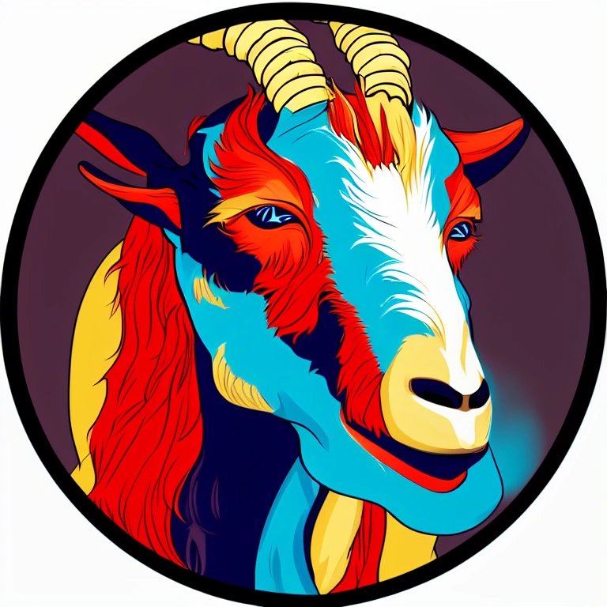

<p align="center" width="100%">

</p>

# Cabra: A portuguese finetuned instruction Open-LLaMA

This repository is intended to share all the steps and resources that we used to finetune our version of Open-LLaMA.

This model is allowed for commercial purposes, by having the license cc-by-sa-3.0. It only used commercially licensed sources.

The project was strongly inspired by [Cabrita](https://github.com/22-hours/cabrita), which had a similar solution but without using commercially licensed sources, and used a smaller 7B model instead of a 13B.

The resulting models can be downloaded at Hugging Face:

- [Cabra-13B-LoRA](https://huggingface.co/Gustrd/open-llama-13b-lora-cabra-adapter) - To use with the [original model](https://huggingface.co/VMware/open-llama-13b-open-instruct);

- [Cabra-13B-Merged](TODO) - To standalone use - TODO;

- [Cabra-13B-GGML](https://huggingface.co/Gustrd/open-llama-13b-lora-cabra-adapter) - For CPU inference, using [llama.cpp](https://github.com/ggerganov/llama.cpp) or [koboldcpp](https://github.com/LostRuins/koboldcpp). Only with the adapter for now;

## References

> If I have seen further it is by standing on the sholders [sic] of Giants.
> -- <cite>Isaac Newton</cite>

We started this section with this citation because everything we accomplished was only possible due to the strong community and the work that other people and groups have done. For our work, we mainly rely on the works developed by: [Cabrita](https://github.com/22-hours/cabrita), [OpenLlama](https://github.com/openlm-research/open_llama), [Hugging Face](https://huggingface.co/), [Open-Instruct](https://github.com/allenai/open-instruct), [VMware](https://huggingface.co/VMware/open-llama-13b-open-instruct), [Dolly](https://github.com/databrickslabs/dolly) and [LibreTranslate](https://github.com/LibreTranslate/LibreTranslate) .So, thank you all for the great work and contribution to the open-source community!


## Data

We translated the [databricks-dolly-15k.jsonl](https://huggingface.co/datasets/databricks/databricks-dolly-15k/resolve/main/databricks-dolly-15k.jsonl) into Portuguese using LibreTranslate. Even if this translation is flawed, the tradeoff between speed, cost and results is good. We were able to do it in a few hours on a consumer-grade laptop.

If you want to know more about how the dataset was built go to: [Dolly](https://github.com/databrickslabs/dolly).

We refrained from using GPT for translation, as the original Cabrita project did, due to licensing issues. Also, the recently released Llama 2 model is currently not licensed for use in Portuguese.

## Finetuning

To fine-tune the OpenLLaMA model, we used as base the code available on [Cabrita](https://github.com/22-hours/cabrita), which provides code to finetune the LLaMA model using PEFT from Hugging Face, we just adapted it to OpenLlama-Instruct. With this, we could run our finetuning step using 1 A4000 at Paperspace on top of OpenLLaMA-OpenInstruct-13B. We trained for about 7 hours and we found the results to be pretty incredible in just that amount of time. The notebook we used is avaible [here](https://github.com/gustrd/cabra/blob/dev/notebooks/qLora-Training-Cabra%20-%20Paperspace.ipynb).

## Example outputs

open-llama-13b-open-instruct:
```
Instruction: Invente uma desculpa criativa pra dizer que não preciso ir à festa.
Response: Sentimento de culpa. Eu não quero ir à festa, pois esse tipo de evento é um local em que as pessoas se reúnem para ter aulas de dança e canto, e também para se divertir e socializar. Mas eu não quero ir, pois estou comum ao público e não quero expor a minha alma ao risco de ser criticada ou ridicularizada.
```

Cabra:
```
Instrução: 
Invente uma desculpa criativa pra dizer que não preciso ir à festa.

Resposta: 
Tenho problemas financeiros.
```

open-llama-13b-open-instruct:
```
Instruction: Como posso começar a carreira como cientista de dados? Escreva na forma de lista.
Response:
1. Obtenha um bacharelado em ciência da computação ou em engenharia da computação.
2. Obtenha um mestrado em ciência da computação ou em engenharia da computação com ênfase em inteligência artificial.
3. Comece a trabalhar em um campo de interesse, como a mensagem, o negócio ou a ciência.
4. Participação em eventos de ciência da computação, como conferências, workshops e congressos.
5. Aplique para bolsas de pesquisa e desenvolvimento.
6. Aplique para o Programa de Pós-Doutoramento em Ciência da Computação da Microsoft.
7. Aplique para o Programa de Pós-Doutoramento em Ciência da Computação da Facebook.
8. Aplique para o Programa de Pós-Doutoramento em Ciência da Computação da Google.
9. Aplique para o Programa de Pós-Doutoramento em Ciência da Computação da Amazon.
```

Cabrita:
```
Instrução: 
Como posso começar a carreira como cientista de dados? Escreva na forma de lista.

Resposta: 
- Estudar matemática, ciência da computação e engenharia. 
- Aprender a usar um framework de desenvolvimento de software que você goste. 
- Aprendendo sobre os conceitos de análise de dados e análises estatísticas. 
- Aprender a fazer visualizações de dados e apresentações. 
- Fazer programas para realizar processamentos de dados. 
- Selecionando uma área de interesse e trabalhando nela. 
- Desenvolver habilidades de comunicação e organização que são importantes para trabalho de dados. 
- Trabalhando em projetos em grupo ou sozinho.
```

You can test it using the eval notebook [here](TODO).

## Next steps

- Create a better Portuguese dataset, using a better translation tool (some options include DeepL or manual adjustment);
- Use a larger open dataset, available for commercial use, like [open-instruct-v1-oasst-dolly-hhrlhf](https://huggingface.co/datasets/VMware/open-instruct-v1-oasst-dolly-hhrlhf) or even [RedPajama-Data](https://github.com/togethercomputer/RedPajama-Data);
- Fine-tune large models when a new OpenLlama is released;
- Create a benchmark to evaluate the quality of each fine-tune;

## Authors

- [gustrd](https://github.com/gustrd)
